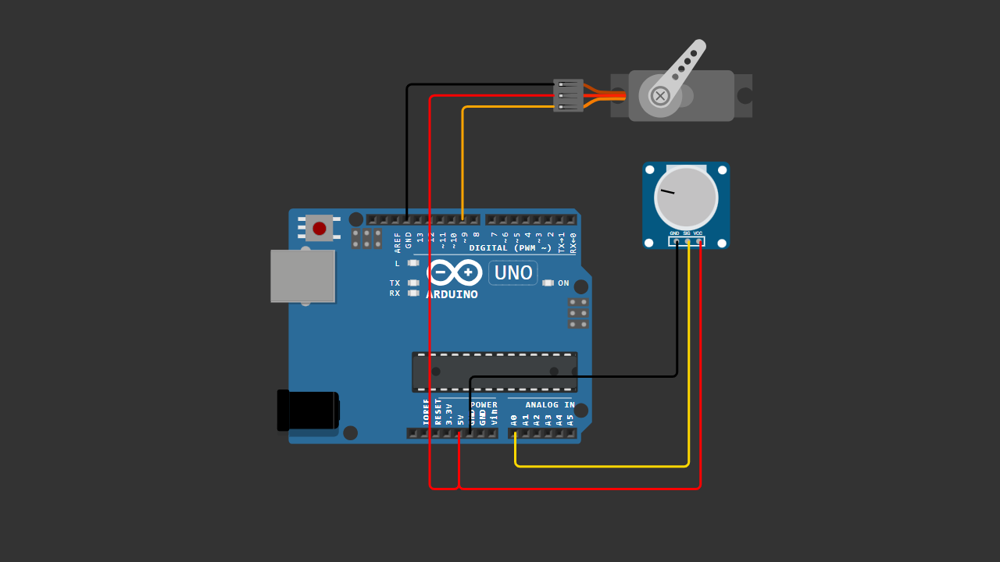

# Arduino Potentiometer Control Servo

Control a servo motor using a potentiometer with Arduino.

This beginner-friendly project demonstrates how analog input can directly control a motor in real time.

---

## 🔧 Components

- Arduino Board
- Potentiometer
- Servo Motor (SG90 recommended)
- Jumper Wires

---

## 🔌 Wiring

### Potentiometer
- Left pin → 5V
- Right pin → GND
- Middle pin → A0

### Servo Motor
- Red → 5V
- Brown/Black → GND
- Orange/Yellow → Pin 9

---

## 📷 Wiring Diagram

> Make sure your wiring matches the table above before uploading the code.

---

## 💻 How It Works

1. The potentiometer generates an analog value (0–1023).
2. The value is converted to 0–180 degrees using the `map()` function.
3. The servo moves according to the converted angle.

---

## ▶️ Arduino Code

Upload the file:

`Arduino_Potentiometer_Servo.ino`

Make sure you have the built-in Servo library installed.

---

## 🎥 Video Tutorial

You can watch the full step-by-step tutorial on YouTube:
👉 https://youtu.be/rCFAe86tTkE

---

## 📌 License

This project is open-source and free to use for educational purposes.
